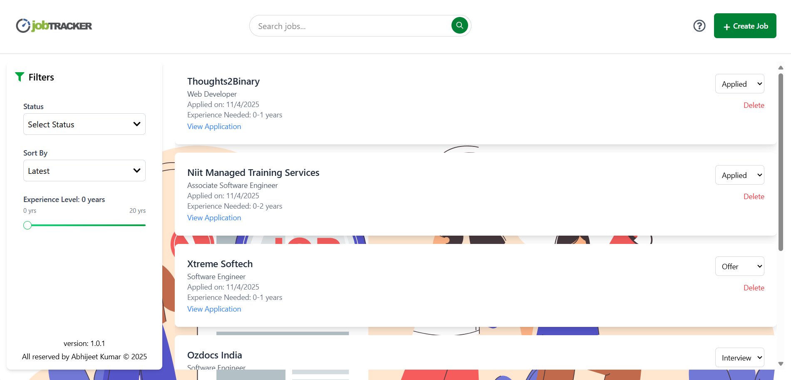
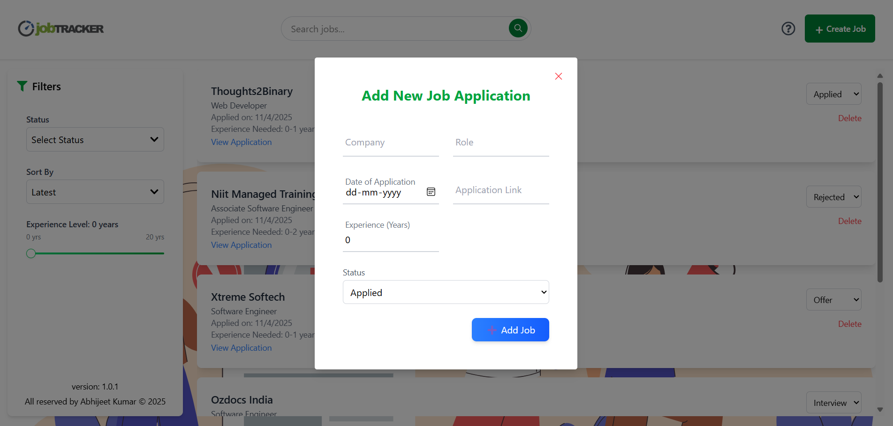
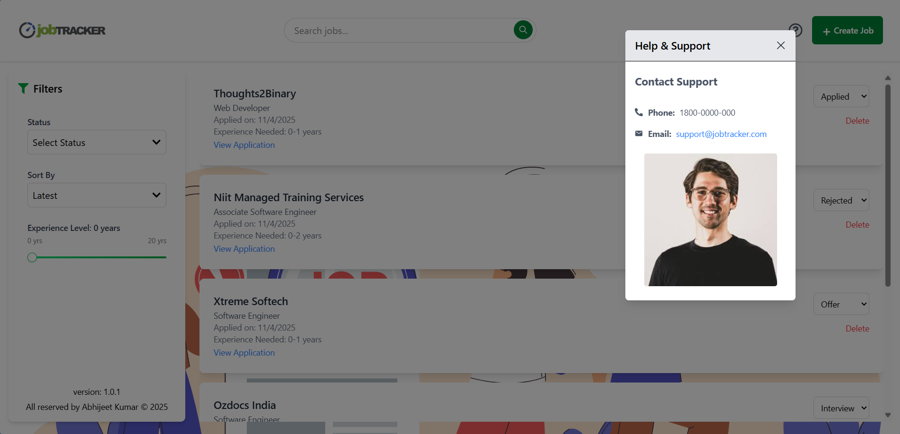

# Job Tracker

Job Tracker is a full-stack web application designed to help users manage their job applications. It allows users to add, update, delete, and filter job applications, providing a seamless experience for job tracking.

## Features

- **Add Job Applications**: Users can add job applications with details like company, role, status, applied date, and experience needed.
- **Filter and Search**: Filter jobs by status, sort by latest or oldest, and search by keywords.
- **Update Job Status**: Update the status of job applications (e.g., Applied, Interview, Offer, Rejected).
- **Pagination**: Navigate through job applications with pagination controls.
- **Responsive Design**: Fully responsive UI built with React and TailwindCSS.

## Tech Stack

### Frontend
- **React**: For building the user interface.
- **Vite**: For fast development and build tooling.
- **TailwindCSS**: For styling.
- **SweetAlert2**: For user-friendly alerts.
- **React Router**: For navigation.

### Backend
- **Node.js**: For server-side logic.
- **Express.js**: For building RESTful APIs.
- **MongoDB**: For storing job application data.
- **Mongoose**: For MongoDB object modeling.
- **dotenv**: For environment variable management.
- **Morgan**: For logging HTTP requests.

## Installation

### Prerequisites
- Node.js (v22 or higher)
- MongoDB (local or cloud instance)

### Steps
1. Clone the repository:
   ```bash
   git clone https://github.com/Abhithakur7080/job-tracker.git
   cd job-tracker

2. Install dependencies for both client and server:
```bash
    cd client
    npm install
    cd ../server
    npm install
```

3. Configure environment variables:
    - Create a `.env` file in the `server` directory based on `.env.sample`.
    - Add your MongoDB connection string and frontend URL.

4. Start the development servers:
```bash
    cd ..
    npm run dev
```
This will concurrently start the client (on `http://localhost:3000`) and server (on `http://localhost:8000`).

### API Endpoints
Base URL
[http://localhost:8000/api/v1/job](http://localhost:8000/api/v1/job)

Routes
    - POST /post: Add a new job.
    - GET /: Get all jobs with filters, search, and pagination.
    - GET /:id: Get a job by ID.
    - PUT /update/:id: Update a job's status.
    - DELETE /delete/:id: Delete a job by ID.

### Screenshots
Home Page


Add Job Modal


Our Support


### License
This project is licensed under the MIT License. See the LICENSE file for details.

### Author
Developed by `Abhijeet Kumar`.